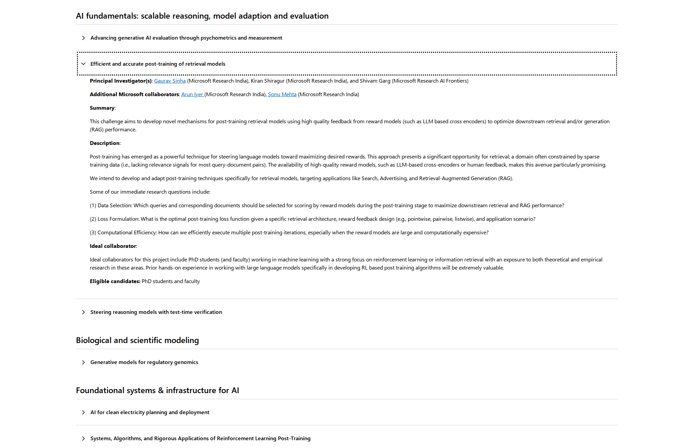

# Efficient and accurate post-training of retrieval models

**Source:** [Microsoft Research Fellowship — Research challenges](https://www.microsoft.com/en-us/research/academic-program/microsoft-research-fellowship/research-challenges/)

## Source screenshot

## Verbatim text

**Principal Investigator(s):** Gaurav Sinha (Microsoft Research India), Kiran Shiragur (Microsoft Research India), and Shivam Garg (Microsoft Research AI Frontiers)

**Additional Microsoft collaborators:** Arun Iyer (Microsoft Research India), Sonu Mehta (Microsoft Research India)

**Summary:**

This challenge aims to develop novel mechanisms for post-training retrieval models using high quality feedback from reward models (such as LLM based cross encoders) to optimize downstream retrieval and/or generation (RAG) performance.

**Description:**

Post-training has emerged as a powerful technique for steering language models toward maximizing desired rewards. This approach presents a significant opportunity for retrieval; a domain often constrained by sparse training data (i.e., lacking relevance signals for most query-document pairs). The availability of high-quality reward models, such as LLM-based cross-encoders or human feedback, makes this avenue particularly promising.

We intend to develop and adapt post-training techniques specifically for retrieval models, targeting applications like Search, Advertising, and Retrieval-Augmented Generation (RAG).

Some of our immediate research questions include:

(1) Data Selection: Which queries and corresponding documents should be selected for scoring by reward models during the post-training stage to maximize downstream retrieval and RAG performance?

(2) Loss Formulation: What is the optimal post-training loss function given a specific retrieval architecture, reward feedback design (e.g., pointwise, pairwise, listwise), and application scenario?

(3) Computational Efficiency: How can we efficiently execute multiple post-training iterations, especially when the reward models are large and computationally expensive?

**Ideal collaborator:**

Ideal collaborators for this project include PhD students (and faculty) working in machine learning with a strong focus on reinforcement learning or information retrieval with an exposure to both theoretical and empirical research in these areas. Prior hands-on experience in working with large language models specifically in developing RL based post training algorithms will be extremely valuable.

**Eligible candidates:** PhD students and faculty

## Selected work related to the challenge themes

A selective, non-exhaustive list, ordered roughly from newest to oldest.

### Principal investigators

#### Gaurav Sinha

**Works on:** causal inference, reinforcement learning, contextual bandits, and RAG planning. [Profile](https://www.microsoft.com/en-us/research/people/gauravsinha/)

- [Contextual Slate GLM Bandits with Limited Adaptivity](https://arxiv.org/abs/2606.31449) — ICML 2026; slate selection with few policy updates.
- [Efficient Algorithms for Logistic Contextual Slate Bandits with Bandit Feedback](https://arxiv.org/abs/2506.13163) — 2025; efficient learning over large slate spaces.
- [Plan*RAG: Efficient Test-Time Planning for Retrieval Augmented Generation](https://arxiv.org/abs/2410.20753) — ICLR 2025 workshop; structured multi-hop retrieval planning.
- [Generalized Linear Bandits with Limited Adaptivity](https://arxiv.org/abs/2404.06831) — NeurIPS 2024; batched and rarely-switching bandits.
- [Combinatorial Categorized Bandits with Expert Rankings](https://proceedings.mlr.press/v216/chowdhury23a.html) — UAI 2023; bandit learning from expert rankings.

#### Kiran Shiragur

**Works on:** vector search, quantization, single- and multi-vector retrieval, diversity, and agentic retrieval. [Profile](https://sites.google.com/view/kiran-shiragur)

- [Incorporating Token Importance in Multi-Vector Retrieval](https://arxiv.org/abs/2511.16106) — AAAI 2026; learned token weighting for late interaction.
- [Welfarist Formulations for Diverse Similarity Search](https://openreview.net/forum?id=UWhOUrsgkA) — ICLR 2026; relevance-diversity objectives for similarity search.
- [α-Reachable Graphs for Multi-vector Nearest Neighbor Search](https://openreview.net/forum?id=v8jSxLHEE9) — ICML VecDB 2025; graph indexing for multi-vector search.
- [Graph-Based Algorithms for Diverse Similarity Search](https://proceedings.mlr.press/v267/anand25a.html) — ICML 2025; graph search with diversity constraints.
- [Sort Before You Prune: Improved Worst-Case Guarantees of the DiskANN Family of Graphs](https://openreview.net/forum?id=JnXbUKtLzz) — ICML 2025; guarantees for DiskANN-style graph construction.

#### Shivam Garg

**Works on:** language-model reasoning, reinforcement learning, efficient inference, and learned algorithms. [Profile](https://cs.stanford.edu/~shivamg/)

- [MEMENTO: Teaching LLMs to Manage Their Own Context](https://arxiv.org/abs/2604.09852) — 2026; learned context management.
- [Endless Terminals: Scaling RL Environments for Terminal Agents](https://arxiv.org/abs/2601.16443) — 2026; scalable environments for agent training.
- [Wait, Wait, Wait... Why Do Reasoning Models Loop?](https://arxiv.org/abs/2512.12895) — ICML 2026; causes of repetitive reasoning.
- [Sample More to Think Less: Group Filtered Policy Optimization for Concise Reasoning](https://arxiv.org/abs/2508.09726) — ICLR 2026; RL for shorter reasoning traces.
- [Discovering Data Structures: Nearest Neighbor Search and Beyond](https://arxiv.org/abs/2411.03253) — NeurIPS 2025; learning nearest-neighbor data structures.

### Additional Microsoft collaborators

#### Arun Iyer

**Works on:** LLM agents, long-context reasoning, feedback-driven knowledge editing, and evaluation. [Profile](https://www.microsoft.com/en-us/research/people/ariy/)

- [Chow-Liu Ordering for Long-Context Reasoning in Chain-of-Agents](https://arxiv.org/abs/2603.09835) — ICLR 2026 workshop; evidence ordering under bounded memory.
- [Continuous Benchmark Generation for Evaluating Enterprise-scale LLM Agents](https://arxiv.org/abs/2511.10049) — ICSE 2026 workshop; evolving agent benchmarks.
- [STACKFEED: Structured Textual Actor-Critic Knowledge Base Editing with Feedback](https://aclanthology.org/2025.emnlp-industry.176/) — EMNLP 2025 Industry; feedback-driven knowledge-base updates.
- [COSMIR: Chain Orchestrated Structured Memory for Iterative Reasoning over Long Context](https://arxiv.org/abs/2510.04568) — NeurIPS 2025 workshop; structured long-context memory.
- [Steering LLMs for Formal Theorem Proving](https://arxiv.org/abs/2502.15507) — 2025; representation steering for proof generation.

#### Sonu Mehta

**Works on:** extreme classification, ANN-based training, hard-negative mining, tail-label performance, and scalable selection. [Profile](https://www.microsoft.com/en-us/research/people/someh/)

- [ASTRA: Accurate and Scalable ANNS-based Training of Extreme Classifiers](https://arxiv.org/abs/2409.20156) — 2024; ANN hard-negative mining and stale-index mitigation.
- [Enhancing Tail Performance in Extreme Classifiers by Label Variance Reduction](https://openreview.net/forum?id=6ARlSgun7J) — ICLR 2024; improved performance on tail labels.
- [Deep Encoders with Auxiliary Parameters for Extreme Classification](https://www.microsoft.com/en-us/research/publication/deep-encoders-with-auxiliary-parameters-for-extreme-classification/) — KDD 2023; scalable deep extreme classification.
- [NGAME: Negative Mining-aware Mini-batching for Extreme Classification](https://arxiv.org/abs/2207.04452) — WSDM 2023; efficient hard-negative mini-batches.
- [Data-driven Test Selection at Scale](https://www.microsoft.com/en-us/research/publication/data-driven-test-selection-at-scale/) — 2021; cost-aware subset selection at large scale.
